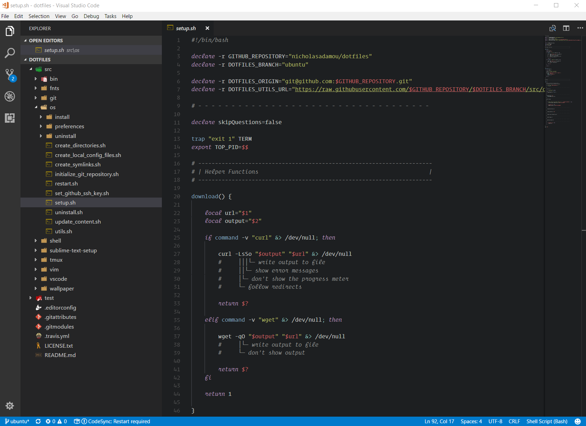

# Visual Studio Code Setup

This document describes how I set up my text editor that I use to develop the tools on my Github page.

If you have any comments or suggestions, feel free to give me a shout [on Twitter](https://twitter.com/nicholasadamou)!

## Setup

To setup Visual Studio Code to look like what is seen in the above image do the following:

1. Install [CodeSync](https://marketplace.visualstudio.com/items?itemName=golf1052.code-sync)
2. Configure `CodeSync` to use [code-sync](code-sync/) as `sync path`.

## Getting Started

- [Visual Studio Code](https://code.visualstudio.com/) - the best text editor for me. I've been using it for years.
- [official Documentation](https://code.visualstudio.com/docs)

## Tools (Better Visual Studio Code)

- [Advanced New File](https://github.com/skuroda/Sublime-AdvancedNewFile) - This plugin allows for faster file creation within a project.
- [EditorConfig](https://marketplace.visualstudio.com/items?itemName=EditorConfig.EditorConfig) - [EditorConfig](http://editorconfig.org/) helps developers maintain consistent coding styles between different editors
- [Better Whitespace](https://marketplace.visualstudio.com/items?itemName=chmln.better-whitespace) - Sublime-like tab and space rendering on selection for VSCode. Shows whitespace in selection, with custom rendering for tabs (currently VSCode has unexpressive arrows.)
- [Debugger for Chrome](https://marketplace.visualstudio.com/items?itemName=msjsdiag.debugger-for-chrome) - Debug your JavaScript code in the Chrome browser.
- [AutoFileName](https://marketplace.visualstudio.com/items?itemName=JerryHong.autofilename) - Auto complete file names.
- [Spell Right](https://marketplace.visualstudio.com/items?itemName=ban.spellright) - A multilingual, offline and «lightweight» spellchecker.
- [emojisense](https://marketplace.visualstudio.com/items?itemName=bierner.emojisense) - Directly insert emojis or type emoji codes in your files.
- [Emoji](https://marketplace.visualstudio.com/items?itemName=Perkovec.emoji) - Plugin to insert emoji from the command palette.
- [Bookmarks](https://marketplace.visualstudio.com/items?itemName=alefragnani.Bookmarks) - Mark lines in the editor and easily jump to them.
- [Bracket Pair Colorizer](https://marketplace.visualstudio.com/items?itemName=CoenraadS.bracket-pair-colorizer) - This extension allows matching brackets to be identified with colours. The user can define which characters to match, and which colours to use.
- [Code Spell Checker](https://marketplace.visualstudio.com/items?itemName=streetsidesoftware.code-spell-checker) - A basic spell checker that works well with camelCase code.
- [Search Docsets](https://marketplace.visualstudio.com/items?itemName=silverlakesoftware.searchdocsets-vscode) - Search docsets in Dash, Velocity, or Zeal - offline documentation and docset viewers.
- [Better Comments](https://marketplace.visualstudio.com/items?itemName=aaron-bond.better-comments) - Improve your code commenting by annotating with alert, informational, TODOs, and more!
- [GitHub Pull Requests](https://marketplace.visualstudio.com/items?itemName=GitHub.vscode-pull-request-github) - Pull Request Provider for GitHub.
- [Auto Rename Tag](https://marketplace.visualstudio.com/items?itemName=formulahendry.auto-rename-tag) - Auto rename paired HTML/XML tags.
- [Auto Close Tag](https://marketplace.visualstudio.com/items?itemName=formulahendry.auto-close-tag) - Automatically add HTML/XML close tag, same as Visual Studio IDE or Sublime Text.
- [Paste and Indent](https://marketplace.visualstudio.com/items?itemName=Rubymaniac.vscode-paste-and-indent) - Paste code with "correct" indentation.
- [vscode-spotify](https://marketplace.visualstudio.com/items?itemName=shyykoserhiy.vscode-spotify) - Use Spotify inside vscode.
- [Slack](https://marketplace.visualstudio.com/items?itemName=sozercan.slack) - Send messages and files to Slack from Visual Studio Code.

## Language Specific Packages

### HTML & CSS

#### Essentials

- [Autoprefixer](https://marketplace.visualstudio.com/items?itemName=mrmlnc.vscode-autoprefixer) - Parse CSS and add vendor prefixes automatically.
- [IntelliSense for CSS class names in HTML](https://marketplace.visualstudio.com/items?itemName=Zignd.html-css-class-completion) - A Visual Studio Code extension that provides CSS class name completion for the HTML class attribute based on the definitions found in your workspace or external files referenced through the link element.

### Javascript

#### Essentials

- [npm](https://marketplace.visualstudio.com/items?itemName=eg2.vscode-npm-script) - npm support for VS Code.
- [npm Intellisense](https://marketplace.visualstudio.com/items?itemName=christian-kohler.npm-intellisense) - Visual Studio Code plugin that autocompletes npm modules in import statements.
- [cdnjs](https://marketplace.visualstudio.com/items?itemName=JakeWilson.vscode-cdnjs) - Search and embed libraries from cdnjs.com in Visual Studio Code.
- [React Native Tools](https://marketplace.visualstudio.com/items?itemName=vsmobile.vscode-react-native) - Code-hinting, debugging and integrated commands for React Native.
- [dotenv](https://marketplace.visualstudio.com/items?itemName=mikestead.dotenv) - Support for dotenv file syntax.
- [ventur](https://marketplace.visualstudio.com/items?itemName=octref.vetur) - Vue tooling for VS Code.
- [vscode-styled-components](https://marketplace.visualstudio.com/items?itemName=jpoissonnier.vscode-styled-components) - Syntax highlighting for styled-components.

#### Linters

- [Prettier](https://marketplace.visualstudio.com/items?itemName=esbenp.prettier-vscode) - VS Code plugin for prettier/prettier.
- [ESLint](https://marketplace.visualstudio.com/items?itemName=dbaeumer.vscode-eslint) - Integrates ESLint JavaScript into VS Code.
- [jslint](https://marketplace.visualstudio.com/items?itemName=ajhyndman.jslint) - Integrates JSLint into VS Code.
- [TSLint](https://marketplace.visualstudio.com/items?itemName=eg2.tslint) - TSLint for Visual Studio Code.
- [jshint](https://marketplace.visualstudio.com/items?itemName=dbaeumer.jshint) - Integrates JSHint into VS Code. JSHint is a linter for JavaScript.
- [.jshintrc Generator](https://marketplace.visualstudio.com/items?itemName=benjavr.jshintrc-generator) - Generates the default .jshintrc file in project root.

#### Snippets

- [ES7 React/Redux/GraphQL/React-Native snippets](https://marketplace.visualstudio.com/items?itemName=dsznajder.es7-react-js-snippets) - Simple extensions for React, Redux and Graphql in JS/TS with ES7 syntax.
- [Reactjs code snippets](https://marketplace.visualstudio.com/items?itemName=xabikos.ReactSnippets) - Code snippets for Reactjs development in ES6 syntax.

### Python

#### Essentials

- [Python](https://marketplace.visualstudio.com/items?itemName=ms-python.python) - Linting, Debugging (multi-threaded, remote), Intellisense, code formatting, refactoring, unit tests, snippets, and more.

#### Snippets

- [python-snippets](https://marketplace.visualstudio.com/items?itemName=cstrap.python-snippets) - Python Snippets.

### Powershell

#### Essentials

- [Powershell](https://marketplace.visualstudio.com/items?itemName=ms-vscode.PowerShell) - Develop PowerShell scripts in Visual Studio Code!

### Bash

#### Essentials

- [shellcheck](https://marketplace.visualstudio.com/items?itemName=timonwong.shellcheck) - An extension to use shellcheck in vscode.

### VIML

#### Essentials

- [vscode-viml-syntax](https://marketplace.visualstudio.com/items?itemName=dunstontc.viml) - Syntax highlighting for .vim files.

## Version Control

- [GitLens](https://marketplace.visualstudio.com/items?itemName=eamodio.gitlens) - GitLens supercharges the Git capabilities built into Visual Studio Code. It helps you to visualize code authorship at a glance via Git blame annotations and code lens, seamlessly navigate and explore Git repositories, gain valuable insights via powerful comparison commands, and so much more.
- [GitMerger](https://marketplace.visualstudio.com/items?itemName=shaharkazaz.git-merger) - Simplifies the git merge process.

## UI

### Fonts

- [Operator Mono](https://www.typography.com/fonts/operator/styles/) - The $200 holy-grail of fonts for developers.
- [Dank Mono](https://dank.sh/) - Dank Mono is the coding font you want.
- [Icon Fonts](https://marketplace.visualstudio.com/items?itemName=idleberg.icon-fonts) - Snippets for a variety of icon fonts.

### Themes

- [Ayu](https://marketplace.visualstudio.com/items?itemName=teabyii.ayu) - A simple theme with bright colors and comes in three versions — dark, light and mirage for all day long comfortable work.

### Misc.

- [vscode icons](https://marketplace.visualstudio.com/items?itemName=robertohuertasm.vscode-icons) - Icons for Visual Studio Code.
- [Paste JSON as Code](https://marketplace.visualstudio.com/items?itemName=quicktype.quicktype) - Copy JSON, paste as Go, TypeScript, C#, C++ and more.
- [markdownlint](https://marketplace.visualstudio.com/items?itemName=DavidAnson.vscode-markdownlint) - Markdown linting and style checking for Visual Studio Code.
- [GraphQL](https://marketplace.visualstudio.com/items?itemName=Prisma.vscode-graphql) - GraphQL extension for VSCode adds syntax highlighting, validation, and language features like go to definition, hover information and autocompletion for graphql projects. This extension also works with queries annotated with gql tag.